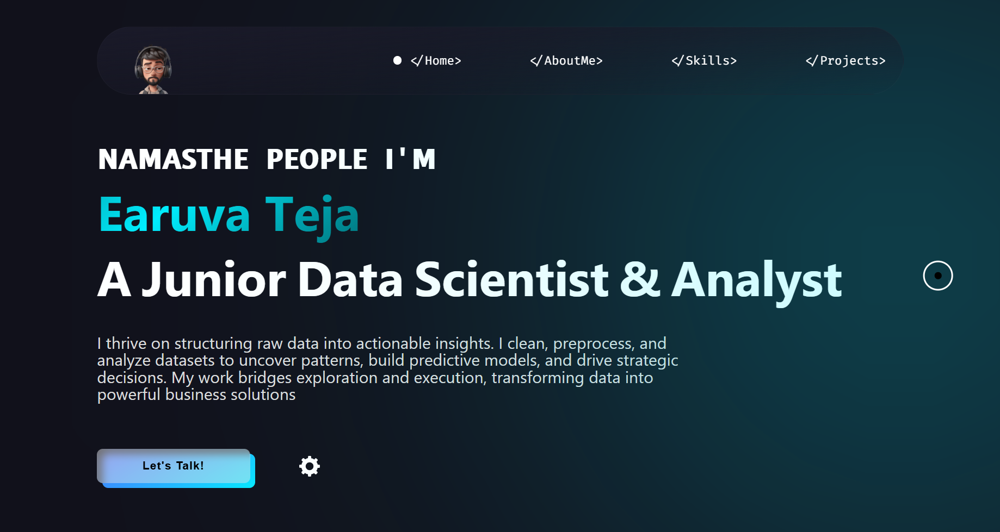

# <a href="https://earuvateja.github.io/" target="_blank">My Portfolio</a>

This website displays my Projects, Web presence, Story, Work experience, and contact information.

:star: Star me on GitHub — it helps!

# Sections 📚

✔️ Mini intro\
✔️ About me \
✔️ Skills\
✔️ Projects\
✔️ Contact me

## Installation & Deployment 📦
- Clone the repository and modify the content of <b>index.html</b> according to your requirement.
- ⚠️ Remove my Bitmoji  from the navbar and use yours instead.⚠️
- Push the generated code to the `master` branch of this repository.
- ⚠️<b>NOTE:</b> Make sure to remove `analyticsId` & `google search console Id` from `<head>` tag, and set yours, if you want to use your own Google Analytics & search console account.⚠️

## Tools Used 🛠️
* [<b>GitHub</b>](https://github.com/) - To host my static website (HTML, CSS, JS).
* [<b>Animate on scroll library</b>](https://github.com/michalsnik/aos) - To animate my website while scrolling.
* [<b>Animista</b>](https://animista.net/) - To use Interactive animations

Please contact me at earuvateja@gmail.com if you have any feedback for the website. :star: Star it, if you like it!
